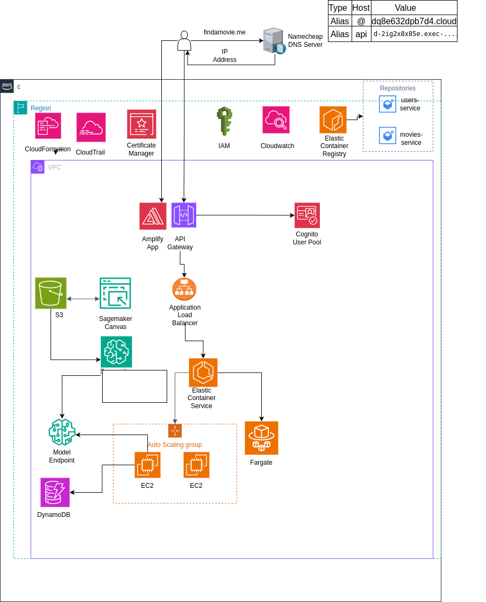
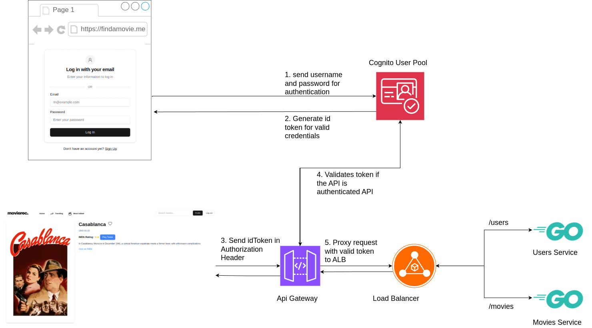

# AWS Cloud-Based Movie Recommendation System

A cloud-native movie recommendation app: Go microservices backend, web frontend, ML-powered recommendations, and AI/LLM-driven suggestions. Users sign up, browse/search movies, like titles, and get recommendations via:

- **KNN in SageMaker** — content-based filtering
- **Google Gemini** — natural-language queries (e.g. “movies like this vibe” or “find this story”)

For a full-stack application like this, we compared ECS with EC2 and ECS with Fargate under specific workload and scaling assumptions. Reach out for the full comparison and results.

## Architecture



- **Frontend** — Web app on **AWS Amplify**
- **Auth** — **Amazon Cognito** for authentication and tokens
- **API** — **API Gateway** → **ALB** → backend services
- **Backend** — Two Go services on **Amazon ECS**: `movies-service`, `users-service`
- **Data** — **DynamoDB** for user preferences; **TMDB** for movie catalog (search, trending, details)
- **ML** — Model artifacts in **S3**; training and real-time inference via **SageMaker**
- **AI/LLM** — **Google Gemini** (e.g. Gemini 2.5 Flash) for natural-language movie suggestions; rate-limited per IP
- **Ops** — **ECR** for images; **CloudWatch** for logs and monitoring


## Services

| Service | Role |
|--------|------|
| **movies-service** | Movie catalog via **TMDB** (search, trending, details, genres). Recommendations: **SageMaker**/local KNN (`POST /movies/recommendations`) and **Gemini** LLM for natural-language prompts (`POST /movies/gpt`, rate-limited). |
| **users-service** | User preferences (likes), stored in DynamoDB; aggregated views (e.g. most liked). |

## Auth flow

1. User signs in with **Cognito** and gets an ID token.
2. Client sends the token in the `Authorization` header.
3. **API Gateway** → **ALB** → backend; protected routes validate the token.





# Movies-service
## Configuration

| Variable | Purpose |
|----------|---------|
| `TMDB_API_KEY` | TMDB API key for movie catalog (search, trending, details). |
| `GEMINI_API_KEY` | Google Gemini API key for the `/movies/gpt` natural-language recommendation endpoint. |

## Local development

Run from the **movies-service** root. The `/movies/recommendations` endpoint uses a local Python script; install deps once:

```bash
pip install -r helpers/requirements.txt
```

Or use a venv: `python3 -m venv .venv`, activate it, then `pip install -r helpers/requirements.txt`. Ensure `helpers/predictor.py` and `recommendation-model/` are present.

The Docker image bundles Python, the predictor, and the model for ECS; no extra setup in AWS.

---

See also: [users-service](https://github.com/findamovieforme/users-service) for user preferences and likes.
